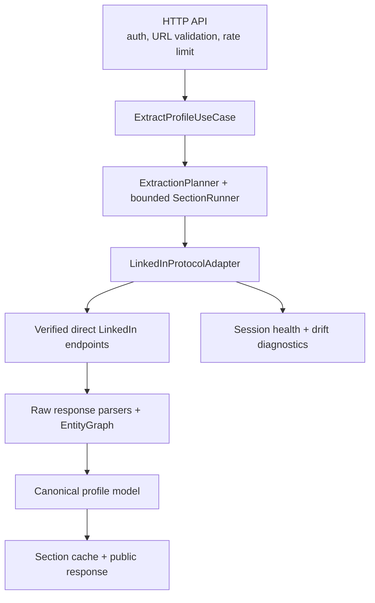

# Tross LinkedIn Profile Extraction API

A drift-aware Node.js/TypeScript API that accepts a LinkedIn `/in/{slug}` URL and returns a stable canonical profile model. The protocol layer is designed for **verified, manually captured LinkedIn internal HTTP requests only**.

> **Current protocol status:** the safe service foundation is complete, but no real sanitized profile-resolution or identity request/response has been supplied. Endpoint manifests and parsers are therefore explicitly unsupported rather than fabricated. Until verified captures are configured, extraction returns a safe session/section availability error. See [Required capture](#required-capture-to-complete-the-protocol-integration).

## Architecture



This is a modular monolith. The HTTP layer does not know LinkedIn routes, query identifiers, cookies, captured headers, or raw response structures. The LinkedIn adapter owns those unstable details. An anti-corruption layer converts them into a stable domain model so `$type`, URNs, tracking fields, query IDs, and component names never escape into the public API.

## Direct-endpoint reverse-engineering approach

The application uses `undici` for direct HTTPS requests. **No browser is used at runtime.** It does not use Playwright, Puppeteer, Selenium, DOM scraping, HTML parsing, proxy rotation, CAPTCHA solving, automated account creation, or access-control bypasses.

A protocol operation is added only after a permitted manual investigation provides:

1. A sanitized copied request showing the exact internal route, method, query parameters, and required non-secret headers.
2. A sanitized JSON response representing the visible profile data.
3. Variants for missing/empty fields where practical.
4. A parser, golden canonical output, structural fingerprint metadata, and tests.

Internal LinkedIn APIs are undocumented and can change. The adapter is accurately described as **drift-aware**, not self-healing.

## Request flow

1. Validate the public API key and public rate limit.
2. Parse the submitted URL without navigating to it.
3. Require HTTPS, an explicitly supported hostname, and exactly `/in/{slug}`.
4. Canonicalize to `https://www.linkedin.com/in/{slug}/`.
5. Read requested section cache entries when `freshness=prefer-cache`.
6. Resolve the slug into verified internal profile context when a live operation is needed.
7. Run independent missing sections with bounded concurrency (default: two).
8. Normalize successful sections and cache canonical data only.
9. Return successful sections plus safe per-section status for failures.

The user-provided URL is never fetched, followed, or used as an outbound destination. All upstream origins and paths must be internal, configured manifests.

## Folder structure

```text
src/
  api/                 # Controllers, middleware, routes, request schemas
  application/         # Use case, planner, bounded section runner
  domain/              # Canonical model and error taxonomy
  infrastructure/      # In-memory cache and structured logging
  linkedin/
    client/             # undici client, retries, classification, circuit breaker
    endpoints/          # Versioned manifests (currently unsupported without captures)
    operations/         # Protocol orchestration
    parsing/            # Entity graph and future verified parsers
    diagnostics/        # Fingerprints, drift reports, fixture replay
fixtures/sanitized/     # Sanitized protocol fixtures only
tests/                  # Unit and mocked integration tests
tools/                  # Fixture replay CLI
```

## Local setup

Requirements: Node.js 20 or newer and npm.

```bash
npm install
cp .env.example .env
# Set a strong PUBLIC_API_KEY. Add LinkedIn session values only through local/deployment secrets.
npm run dev
```

The app validates configuration with Zod at startup. `GET /health` is public; `/v1/*` routes require `X-API-Key`.

## Environment variables

| Variable                      | Required          | Default       | Purpose                                          |
| ----------------------------- | ----------------- | ------------- | ------------------------------------------------ |
| `PUBLIC_API_KEY`              | Yes               | —             | Public API authentication; minimum 16 characters |
| `PORT`                        | No                | `3000`        | HTTP listener port                               |
| `NODE_ENV`                    | No                | `development` | Runtime mode                                     |
| `LINKEDIN_COOKIE`             | For live protocol | —             | Externally supplied session cookie               |
| `LINKEDIN_CSRF_TOKEN`         | For live protocol | —             | Matching CSRF value                              |
| `LINKEDIN_USER_AGENT`         | For live protocol | —             | User agent from the permitted capture            |
| `UPSTREAM_TIMEOUT_MS`         | No                | `8000`        | Per-upstream-request timeout                     |
| `REQUEST_DEADLINE_MS`         | No                | `20000`       | Extraction deadline                              |
| `UPSTREAM_CONCURRENCY`        | No                | `2`           | Bounded section concurrency; maximum 3           |
| `SECTION_CACHE_TTL_SECONDS`   | No                | `21600`       | Successful section TTL (six hours)               |
| `PUBLIC_RATE_LIMIT_MAX`       | No                | `60`          | Requests per client window                       |
| `PUBLIC_RATE_LIMIT_WINDOW_MS` | No                | `60000`       | Public rate-limit window                         |
| `LOG_LEVEL`                   | No                | `info`        | Pino log level                                   |

All three LinkedIn session variables must be supplied together or omitted together. Never commit `.env` or deployment secrets.

## API documentation

The complete OpenAPI 3.1 contract is in [`openapi.yaml`](./openapi.yaml).

### Health

```http
GET /health
```

```json
{ "status": "ok", "timestamp": "2026-08-28T00:00:00.000Z" }
```

### Extract profile

```bash
curl --request POST 'http://localhost:3000/v1/profiles/extract' \
  --header 'X-API-Key: replace-with-your-public-api-key' \
  --header 'Content-Type: application/json' \
  --data '{
    "url": "https://www.linkedin.com/in/synthetic-profile/",
    "sections": ["identity", "experience", "education", "skills", "certifications", "languages"],
    "freshness": "prefer-cache"
  }'
```

Sections are optional and default to all supported sections. `freshness` is `prefer-cache` or `live`.

Sanitized shape example (illustrative canonical data, not a claim that the currently unsupported protocol operation succeeds):

```json
{
  "profile": {
    "profileUrl": "https://www.linkedin.com/in/synthetic-profile/",
    "identity": {
      "name": "Synthetic Person",
      "firstName": "Synthetic",
      "lastName": "Person",
      "headline": null,
      "location": null,
      "about": null,
      "images": { "profile": null, "background": null }
    },
    "experience": [],
    "education": [],
    "skills": [],
    "certifications": [],
    "languages": []
  },
  "meta": {
    "partial": true,
    "retrievedAt": "2026-08-28T00:00:00.000Z",
    "cached": false,
    "sections": {
      "identity": { "status": "success", "source": "identity.v1", "durationMs": 120 },
      "skills": { "status": "failed", "error": "UPSTREAM_SCHEMA_CHANGED", "durationMs": 94 }
    }
  }
}
```

### Protected upstream health

```bash
curl --header 'X-API-Key: replace-with-your-public-api-key' \
  'http://localhost:3000/v1/upstream/health'
```

This endpoint exposes only session status, timestamps, operation compatibility status, and a drift boolean. It never exposes cookies, CSRF values, internal URLs, captured headers, raw responses, query identifiers, or profile data.

## Authentication and session lifecycle

LinkedIn session material is supplied externally; automatic username/password login is intentionally absent. Cookies, CSRF values, authorization-related fields, API keys, profile content, and raw bodies are redacted or excluded from logs and public errors.

A `401`, `403`, or detected login/checkpoint HTML response marks the session unhealthy and opens an in-process circuit breaker. New upstream requests fail safely with `SESSION_UNAVAILABLE`. Replace deployment secrets and restart the process to restore health. Session cookies expire and require manual rotation. Visible data depends on the authenticated session and LinkedIn visibility rules.

## Retry policy

At most one retry is made, with exponential delay and jitter, for a timeout/network failure or temporary upstream `502`/`503`. Authentication failures, checkpoints, `429`, profile-not-found responses, parser failures, and schema drift are not retried. A strict operation timeout and extraction deadline bound work.

## Caching strategy

Successful canonical sections are cached independently under `profile:{slug}:{section}` for six hours by default. Raw LinkedIn responses and authentication failures are never cached as profile results. `live` bypasses reads but successful normalized values can refresh the cache.

The included cache is process-local. A multi-instance production deployment should replace the cache interface with Redis so instances share values and invalidation.

## Error taxonomy

| Code                                                                |                                                  Typical HTTP status |
| ------------------------------------------------------------------- | -------------------------------------------------------------------: |
| `INVALID_PROFILE_URL`                                               |                                                                  400 |
| `UNSUPPORTED_PROFILE_URL`                                           |                                                                  422 |
| `PROFILE_NOT_FOUND`                                                 |                                                                  404 |
| `SESSION_UNAVAILABLE`, `SESSION_CHALLENGE`                          |                                                                  503 |
| `UPSTREAM_RATE_LIMITED`, `UPSTREAM_TIMEOUT`, `UPSTREAM_UNAVAILABLE` |                                                                  503 |
| `UPSTREAM_REJECTED`, `UPSTREAM_SCHEMA_CHANGED`                      |                                                                  502 |
| `SECTION_UNAVAILABLE`                                               | 503 when no extraction can start; otherwise section failure metadata |
| `INTERNAL_ERROR`                                                    |                                                                  500 |

Public API authentication failures return `401`; the public rate limiter returns `429`. Public messages are fixed and never contain raw upstream bodies.

## Drift detection and fixture replay

Structural fingerprints collect sorted JSON paths and types, never values, and hash them with SHA-256. New optional paths are `compatible_drift`; a missing or type-changed required parser path is `breaking_drift`. Login/checkpoint responses are classified as session failures before JSON drift checks.

```bash
npm run protocol:replay
```

The command discovers sanitized fixtures, invokes the registered parser, compares canonical output to `expected.json`, computes a fingerprint, compares metadata, prints a compatibility report, and exits non-zero for an unavailable parser or golden-output failure. At present it reports that no fixtures exist because no verified response has been supplied.

Raw responses must remain under ignored `fixtures/raw/`. The sanitizer fails closed unless every non-boolean scalar is explicitly replaced or preserved by JSON path; it automatically redacts secret-bearing keys and refuses to overwrite its input:

```bash
npm run protocol:sanitize -- \
  fixtures/raw/upstream.json \
  fixtures/sanitized/identity/standard/upstream.json \
  fixtures/raw/sanitization-policy.json
```

A policy has the shape below. Replacement values must retain the original JSON type. `$type`, booleans, and `null` are structurally preserved; every explicit `preservePaths` entry must be privacy-reviewed.

```json
{
  "replacements": {
    "$.included[0].firstName": "Synthetic",
    "$.included[0].entityUrn": "urn:li:fsd_profile:SYNTHETIC_1"
  },
  "preservePaths": ["$.data.paging.total"]
}
```

The generated file still requires manual privacy review before it is staged.

## Testing

All upstream HTTP calls are mocked. No live integration test runs in CI by default.

```bash
npm run format:check
npm run lint
npm run typecheck
npm test
npm run protocol:replay
npm run build
```

Coverage includes URL normalization and malicious URLs, API keys, public error sanitization, entity indexing, partial extraction, cache hits/misses, bounded concurrency, authentication/checkpoint and HTML classification, rate limits, retries, circuit breaking, schema fingerprints, and fixture replay. GitHub Actions runs the complete offline verification suite and builds the production container without LinkedIn or deployment secrets.

## Docker usage

```bash
docker build -t tross-linkedin-api .
docker run --rm -p 3000:3000 \
  -e PUBLIC_API_KEY='replace-with-a-strong-random-key' \
  tross-linkedin-api
```

Supply LinkedIn session variables with runtime secrets, never Docker build arguments or image layers. Docker Compose can load a local uncommitted `.env`.

## Render deployment

1. Create a Render Web Service from this repository and select `feat/linkedin-protocol-adapter` until merged into `main`.
2. Use the included Dockerfile.
3. Configure `PUBLIC_API_KEY`, `LINKEDIN_COOKIE`, `LINKEDIN_CSRF_TOKEN`, and `LINKEDIN_USER_AGENT` as Render secrets.
4. Set health check path to `/health`.
5. Deploy, then verify `/health`, authenticated `/v1/upstream/health`, and `/v1/profiles/extract`.
6. Do not expect extraction to succeed until verified manifests and parsers are implemented from sanitized captures.

Render provides HTTPS at its public service origin. This repository does not contain Render credentials or a service identifier, so deployment cannot be performed from source alone.

## Security considerations

- The submitted URL is parsed only; it is never requested.
- Only HTTPS and `linkedin.com`/`www.linkedin.com` with `/in/{slug}` are accepted.
- Ports, credentials, query strings, fragments, encoded paths, extra path segments, Sales Navigator, company, job, and search URLs are rejected.
- Outbound origin and manifest paths are controlled internally.
- Request bodies are limited to 16 KiB.
- Secrets are loaded from environment variables and redacted from structured logs.
- Raw copied cURL requests, HAR files, session state, raw responses, and personal fixtures are prohibited from Git.
- The software does not bypass CAPTCHA or access controls.
- LinkedIn's terms and applicable privacy/data-protection requirements must be reviewed before production use.

## Known limitations

- Profile resolution and all section manifests/parsers are blocked pending verified sanitized protocol artifacts.
- LinkedIn internal APIs are undocumented and may change without notice.
- Session cookies expire and require external rotation.
- LinkedIn may rate-limit, reject, or challenge direct requests.
- Data visibility depends on the authenticated session.
- Partial results may be returned when individual sections fail.
- Image URLs, once implemented, may be signed and may expire.
- The in-memory cache and rate limiter are per instance.
- Circuit health resets on process restart; there is no distributed state.
- The integration is drift-aware, not self-healing.

## Tradeoffs and future improvements

The modular monolith keeps deployment and review simple while isolating unstable protocol details. Section-level caching and failures reduce upstream load and preserve useful output, at the cost of mixed retrieval times. The generic boundaries are intentionally small; no plugin framework, workflow engine, database, queue, or microservice is introduced.

After verified protocol completion, useful improvements include Redis-backed cache/rate limiting, metrics and alerts for drift/session transitions, fixture variants for optional fields, opt-in live smoke tests in a protected environment, and deployment automation using user-provided Render authorization.

## Required capture to complete the protocol integration

Please provide the first **sanitized** LinkedIn profile-resolution/identity request and matching JSON response. It must remove or replace:

- `cookie`, `csrf-token`, authorization values, account/session identifiers, and sensitive captured headers;
- real names, profile text, contact information, company/school names, image URLs, and identifiable URNs;
- tracking values or request identifiers tied to a person/session.

Keep the exact HTTP method, internal path shape, query parameter names, required header names, JSON keys, `$type` discriminators, reference relationships, and value types. If resolution and identity are separate requests, provide both pairs and label them. Do not send a HAR or a cURL command containing live credentials.
