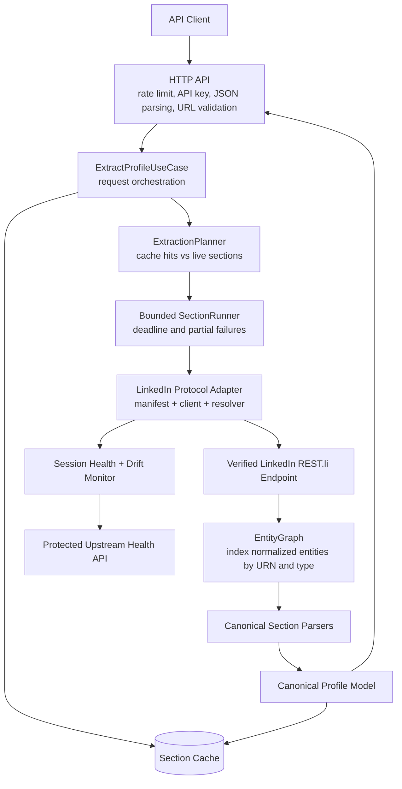

# Tross LinkedIn Profile Extraction API

A production-oriented Node.js/TypeScript API that accepts a LinkedIn profile URL and returns the profile's visible data as stable, structured JSON. At runtime it communicates directly with a verified LinkedIn REST.li endpoint. It does not run a browser, render a page, or scrape HTML.

The service extracts these fields when the authenticated LinkedIn session can see them:

- Name, first name, and last name
- Headline, location, and about/summary
- Profile image and background image
- Experience and education
- Skills, certifications, and languages

The protocol integration has been live-tested against LinkedIn's `FullProfileWithEntities-101` response. A single upstream request supplies the normalized entity graph used by every public profile section.

> LinkedIn's internal APIs are undocumented and can change without notice. This project detects failures and schema incompatibility, but it cannot guarantee that an internal endpoint or session will continue working indefinitely.

## Table of contents

- [What this project does](#what-this-project-does)
- [What this project does not do](#what-this-project-does-not-do)
- [Architecture](#architecture)
- [How the architecture works](#how-the-architecture-works)
- [End-to-end request lifecycle](#end-to-end-request-lifecycle)
- [How LinkedIn data is represented](#how-linkedin-data-is-represented)
- [Project structure](#project-structure)
- [Requirements](#requirements)
- [Getting the LinkedIn session values](#getting-the-linkedin-session-values)
- [Local setup](#local-setup)
- [Using the API](#using-the-api)
- [Understanding the response](#understanding-the-response)
- [Caching and freshness](#caching-and-freshness)
- [Authentication and session lifecycle](#authentication-and-session-lifecycle)
- [Failure handling and retries](#failure-handling-and-retries)
- [Observability and drift detection](#observability-and-drift-detection)
- [Testing](#testing)
- [Docker usage](#docker-usage)
- [Use the hosted API](#use-the-hosted-api)
- [Troubleshooting](#troubleshooting)
- [Security and privacy](#security-and-privacy)
- [Architecture tradeoffs](#architecture-tradeoffs)
- [Known limitations](#known-limitations)

## What this project does

The public API receives a URL such as:

```text
https://www.linkedin.com/in/synthetic-person/
```

It validates and canonicalizes the URL, extracts only the profile slug, and sends a server-controlled request to this LinkedIn API resource:

```text
GET /voyager/api/identity/dash/profiles
  ?q=memberIdentity
  &memberIdentity={profile-slug}
  &decorationId=com.linkedin.voyager.dash.deco.identity.profile.FullProfileWithEntities-101
```

LinkedIn returns normalized JSON containing a graph of entities and URN references. The service dereferences that graph and converts LinkedIn-specific structures into a stable public response model.

For example, LinkedIn may represent experience as:

```text
Profile
  -> collection-response URN
  -> PositionGroup URN
  -> another collection-response URN
  -> Position URN
  -> Company / EmploymentType / Geo URNs
```

API consumers never need to understand those references. They receive a regular array of experience objects containing fields such as title, company, employment type, location, description, dates, and `isCurrent`.

### Core capabilities

| Capability              | Behavior                                                                                                          |
| ----------------------- | ----------------------------------------------------------------------------------------------------------------- |
| Browserless runtime     | Uses `undici` to make direct HTTPS requests.                                                                      |
| Stable public model     | LinkedIn `$type`, URNs, recipe types, tracking fields, and collection envelopes do not escape the protocol layer. |
| Selective extraction    | Clients may request all sections or only specific sections.                                                       |
| One live request        | Any live cache miss causes one full-profile request, not one LinkedIn request per section.                        |
| Partial-result support  | Independent section failures can be represented without discarding successful sections.                           |
| Section cache           | Successful canonical sections are cached separately. Raw LinkedIn bodies are not cached.                          |
| Session circuit breaker | Authentication or checkpoint responses mark the session unavailable and prevent repeated failing requests.        |
| Drift awareness         | Parser success and schema failures are reported through safe health metadata.                                     |
| Public API protection   | API-key authentication, URL validation, request-size limits, and per-process rate limiting are included.          |
| Secret-safe logging     | Cookies, API keys, authorization headers, profile bodies, and CSRF values are redacted or excluded.               |

## What this project does not do

The runtime does not use:

- Playwright, Puppeteer, Selenium, or another browser automation framework
- DOM parsing or HTML scraping
- Automatic LinkedIn username/password login
- CAPTCHA or checkpoint bypassing
- Proxy rotation or automated account creation
- User-controlled outbound URLs
- A database, queue, workflow engine, or microservice fleet

A browser may be used manually by the account owner to inspect their own authenticated network requests and obtain current session values. That investigation process is separate from the deployed application. The deployed service itself remains browserless.

## Architecture



This is a modular monolith. All responsibilities live in one deployable Node.js process, but the code is separated into layers with explicit boundaries.

That choice is intentional: this challenge needs one reliable HTTP service, not distributed infrastructure. The boundaries make the unstable LinkedIn protocol replaceable without introducing the operational cost of microservices.

## How the architecture works

### 1. API client

The client can be a command-line script, frontend, backend service, Postman, or any HTTP client. It sends JSON to `POST /v1/profiles/extract` with its public API key in `X-API-Key`.

The client never supplies LinkedIn cookies. LinkedIn credentials belong only to the server. This centralizes session material, keeps the public contract stable, and allows the service to rate-limit callers independently of LinkedIn.

### 2. HTTP API boundary

Relevant code lives under `src/api/` and `src/app.ts`.

This stage performs:

1. Request logging with sensitive-header redaction.
2. JSON parsing with a 16 KiB body limit.
3. Per-client rate limiting.
4. Constant-time API-key comparison.
5. Zod request validation.
6. LinkedIn URL validation and canonicalization.
7. Conversion of internal errors into fixed public messages.

Only these hosts and paths are accepted:

```text
https://linkedin.com/in/{slug}
https://www.linkedin.com/in/{slug}
```

The parser rejects ports, credentials, query strings, fragments, encoded paths, backslashes, extra path segments, and non-HTTPS URLs.

The submitted URL is never fetched. Only its validated slug is used as a query value in a fixed, server-controlled endpoint manifest. This prevents the profile URL field from becoming an SSRF primitive.

### 3. `ExtractProfileUseCase`

This is the application-level orchestrator in `src/application/extract-profile.use-case.ts`. It does not understand LinkedIn JSON. It coordinates the workflow:

- Create an empty canonical profile.
- Read requested sections from cache when allowed.
- Determine which sections still require live data.
- Resolve the profile through the LinkedIn adapter once.
- Run the missing section operations.
- Apply successful results to the canonical profile.
- Store successful canonical sections in cache.
- Build response metadata.

Keeping orchestration separate from HTTP and parsing makes it testable with fake resolvers, operations, and caches.

### 4. `ExtractionPlanner`

The planner compares requested sections with cache hits.

```text
Requested: identity, experience, education, skills
Cached:    identity, education
Live plan: experience, skills
```

If every requested section is cached, no LinkedIn request is made. If at least one section is missing, the full profile is fetched once and only the missing sections are applied.

### 5. `SectionRunner`

The runner provides a uniform boundary for section work. It enforces:

- Bounded concurrency
- A total extraction deadline
- Per-section duration measurement
- Settled-promise handling
- Independent failure metadata

The current full-profile protocol requires only one upstream request, so section work is primarily parsing. The runner remains useful because it prevents a future expensive section operation from blocking or crashing the entire extraction flow.

A schema exception is converted into a rejected promise before entering the runner. Synchronous parser exceptions therefore become controlled section failures instead of escaping orchestration.

### 6. LinkedIn protocol adapter

The LinkedIn-specific implementation lives under `src/linkedin/` and owns three responsibilities:

- Endpoint manifest: fixed path, headers, decoration ID, and query construction.
- HTTP client: cookies, CSRF, timeouts, response classification, retries, and session health.
- Resolver/parser: normalized envelope to internal context and canonical sections.

The public HTTP layer never knows the LinkedIn endpoint or response schema. This anti-corruption layer isolates upstream instability behind a stable interface.

### 7. Verified LinkedIn endpoint

The endpoint manifest defines:

- Origin: fixed as `https://www.linkedin.com`
- Path: `/voyager/api/identity/dash/profiles`
- Method: `GET`
- Query mode: `memberIdentity`
- Member identity: validated profile slug
- Decoration: `FullProfileWithEntities-101`
- REST.li protocol header: `2.0.0`
- Accept header: LinkedIn normalized vendor JSON

The client accepts standard `application/json` and structured vendor types containing `+json`, including LinkedIn's normalized media type.

### 8. `EntityGraph`

LinkedIn returns an `included[]` array containing different entity types. Those entities reference one another through fields such as `entityUrn`, `*profilePositionGroups`, `*profilePositionInPositionGroup`, `*employmentType`, and `*geo`.

`EntityGraph` indexes included entities:

- By stable URN for reference lookup
- By `$type` for type-based fallback lookup

This avoids fragile parsing based on array positions. An entity appearing at `included[12]` today may appear at `included[3]` tomorrow; its URN and type are the meaningful identifiers.

### 9. Canonical section parsers

| Section          | Upstream entities/fields used                                                |
| ---------------- | ---------------------------------------------------------------------------- |
| `identity`       | Profile, Geo, profile picture vector artifacts, background picture artifacts |
| `experience`     | PositionGroup, Position, EmploymentType, dates, location, description        |
| `education`      | Education and date-range entities                                            |
| `skills`         | Skill entities                                                               |
| `certifications` | Name, authority, time period, credential ID and URL                          |
| `languages`      | Language name and proficiency                                                |

For images, the parser selects the largest available vector artifact and combines its root URL with its identifying path segment. Image fields remain `null` when LinkedIn does not provide a usable artifact.

### 10. Canonical profile model

The canonical model under `src/domain/` is the application's stable contract. It contains no LinkedIn implementation details.

This provides two production benefits:

1. API consumers do not break merely because LinkedIn renames an internal type or changes reference layout.
2. A future protocol implementation can replace the current endpoint without redesigning the public response.

### 11. Section cache

The default cache is an in-memory `Map` behind a small cache interface. Keys have this form:

```text
profile:{slug}:{section}
```

Only successfully normalized canonical sections are cached. Raw LinkedIn responses, authentication failures, and parser failures are not cached as profile data.

The default TTL is six hours. Because the cache is process-local, it is cleared on restart and is not shared across instances.

### 12. Session health and drift monitor

Session states:

- `unknown`: credentials are configured but no successful live validation has occurred.
- `healthy`: the last validation succeeded.
- `unavailable`: credentials are missing or LinkedIn rejected the session.
- `challenge`: LinkedIn returned a login/checkpoint/challenge response.

Operation states:

- `unknown`: not parsed during this process lifetime.
- `healthy`: parsed successfully.
- `compatible_drift`: optional structural change did not break canonical parsing.
- `breaking_drift`: required parser structure changed.
- `session_failure`: reserved by the health contract for session-related observations.

These states are exposed through a protected endpoint without returning cookies, profile content, raw bodies, internal URLs, query IDs, or captured headers.

## End-to-end request lifecycle

For `freshness: "live"`, the lifecycle is:

1. Express receives the request.
2. Pino assigns request context and redacts configured secrets.
3. The rate limiter increments the caller's in-process window.
4. The API-key middleware validates `X-API-Key` using `timingSafeEqual` when lengths match.
5. Zod validates the body and rejects unknown fields.
6. The URL parser validates HTTPS, hostname, path, and slug.
7. The use case creates an empty canonical profile.
8. Cache reads are skipped because freshness is `live`.
9. The resolver builds a request from the fixed endpoint manifest.
10. `LinkedInClient` checks the session circuit breaker.
11. `undici` sends the cookie, CSRF token, user agent, accept header, and REST.li headers.
12. The client classifies status, content type, login/checkpoint HTML, and JSON validity.
13. A successful response marks the session healthy.
14. The resolver locates the Profile entity and creates request-scoped context containing the normalized envelope.
15. The runner invokes parsers only for requested, uncached sections.
16. `EntityGraph` resolves URN relationships.
17. Parsers produce canonical data and report healthy operation status.
18. Successful sections are cached independently.
19. The use case builds `profile` and `meta`.
20. The controller logs safe outcomes and returns JSON.

## How LinkedIn data is represented

LinkedIn's normalized API separates references from entities:

```json
{
  "data": { "*elements": ["urn:li:fsd_profile:SYNTHETIC"] },
  "included": [
    {
      "entityUrn": "urn:li:fsd_profile:SYNTHETIC",
      "*profileSkills": "urn:li:collectionResponse:SYNTHETIC_SKILLS",
      "$type": "com.linkedin.voyager.dash.identity.profile.Profile"
    },
    {
      "entityUrn": "urn:li:collectionResponse:SYNTHETIC_SKILLS",
      "*elements": ["urn:li:fsd_skill:SYNTHETIC_1"],
      "$type": "com.linkedin.restli.common.CollectionResponse"
    },
    {
      "entityUrn": "urn:li:fsd_skill:SYNTHETIC_1",
      "name": "TypeScript",
      "$type": "com.linkedin.voyager.dash.identity.profile.Skill"
    }
  ]
}
```

The public API converts that graph into:

```json
{ "skills": [{ "name": "TypeScript" }] }
```

This graph-first design is more maintainable than searching arbitrary nested objects or relying on array order.

## Project structure

```text
.
├── src/
│   ├── api/
│   │   ├── controllers/       # Translate HTTP requests/responses
│   │   ├── middleware/        # API key, rate limit, and error handling
│   │   ├── routes/            # Express route composition
│   │   └── schemas/           # Zod validation and URL parsing
│   ├── application/
│   │   ├── extract-profile.use-case.ts
│   │   ├── extraction-planner.ts
│   │   └── section-runner.ts
│   ├── domain/
│   │   ├── errors.ts          # Safe error taxonomy
│   │   ├── extraction.ts      # Response metadata model
│   │   └── profile.ts         # Canonical profile model
│   ├── infrastructure/
│   │   ├── cache/             # Cache interface and memory implementation
│   │   └── logging/           # Pino and redaction
│   ├── linkedin/
│   │   ├── client/            # Direct HTTP transport and session breaker
│   │   ├── diagnostics/       # Drift, fingerprints, fixture tooling
│   │   ├── endpoints/         # Verified endpoint manifest
│   │   ├── operations/        # Full-profile resolution
│   │   └── parsing/           # Entity graph and canonical parsers
│   ├── app.ts                 # Express composition
│   ├── composition.ts         # Production dependency wiring
│   ├── config.ts              # Environment validation
│   └── server.ts              # Startup and graceful shutdown
├── tests/
│   ├── integration/           # HTTP behavior using local test servers
│   └── unit/                  # Protocol, parser, cache, and security tests
├── fixtures/
│   ├── raw/                   # Git-ignored private captures
│   └── sanitized/             # Privacy-reviewed replay fixtures only
├── tools/                     # Fixture sanitizer and replay commands
├── openapi.yaml               # OpenAPI 3.1 contract
├── Dockerfile                 # Multi-stage production image
├── docker-compose.yml         # Local container orchestration
├── render.yaml                # Render service blueprint
└── .github/workflows/ci.yml   # Offline CI verification
```

## Requirements

- Node.js 20 or newer
- npm
- A LinkedIn session belonging to an account you are authorized to use
- Permission to access and process the target profile data

```bash
node --version
npm --version
```

## Getting the LinkedIn session values

The service does not accept a LinkedIn email or password. It uses an existing authenticated session.

Use your own logged-in LinkedIn account and inspect a normal request in browser Developer Tools:

1. Sign in to LinkedIn normally.
2. Open Developer Tools and select Network.
3. Load a profile your account can view.
4. Select an authenticated request to `/voyager/api/`.
5. Copy the complete `Cookie` request-header value.
6. Copy the `csrf-token` request header.
7. Copy the exact `User-Agent` request header.
8. Store those values only in local or deployment secrets.

The cookie normally includes `li_at` and `JSESSIONID`. The CSRF token normally equals `JSESSIONID` without surrounding quotes:

```text
Cookie fragment: JSESSIONID="ajax:123456789..."
csrf-token:      ajax:123456789...
```

Never paste these values into an issue, commit, README, build argument, image layer, or public deployment log.

## Local setup

### 1. Install dependencies

```bash
npm install
```

### 2. Create local configuration

```bash
cp .env.example .env
```

Edit `.env`:

```env
NODE_ENV=development
PORT=3000
PUBLIC_API_KEY=replace-with-a-long-random-public-api-key

LINKEDIN_COOKIE='li_at=REDACTED; JSESSIONID="ajax:REDACTED"; other_cookie=REDACTED'
LINKEDIN_CSRF_TOKEN=ajax:REDACTED
LINKEDIN_USER_AGENT=Mozilla/5.0 ...

UPSTREAM_TIMEOUT_MS=8000
REQUEST_DEADLINE_MS=20000
UPSTREAM_CONCURRENCY=2
SECTION_CACHE_TTL_SECONDS=21600
PUBLIC_RATE_LIMIT_MAX=60
PUBLIC_RATE_LIMIT_WINDOW_MS=60000
LOG_LEVEL=info
```

Use outer single quotes for the complete cookie when it contains quoted `JSESSIONID`. This preserves the inner double quotes when Node loads `.env`.

Generate a strong public API key:

```bash
openssl rand -hex 32
```

`PUBLIC_API_KEY` protects your API. It is different from the LinkedIn session and must be at least 16 characters.

### 3. Start development mode

```bash
npm run dev
```

Development mode uses `tsx watch`, loads `.env`, and restarts when TypeScript files change.

If port 3000 is occupied, set another port in `.env`:

```env
PORT=3107
```

### 4. Verify process health

```bash
curl 'http://localhost:3000/health'
```

```json
{
  "status": "ok",
  "timestamp": "2026-08-31T00:00:00.000Z"
}
```

This proves only that the process is accepting requests. It does not contact LinkedIn or prove session validity.

### 5. Verify upstream state

```bash
curl \
  --header 'X-API-Key: replace-with-your-public-api-key' \
  'http://localhost:3000/v1/upstream/health'
```

Before the first live request, a configured session is normally `unknown`. After a successful extraction, it becomes `healthy`.

### Production-style local startup

```bash
npm run build
node --env-file=.env dist/server.js
```

`npm start` expects the production environment or container runtime to inject variables. The explicit Node command above loads `.env` for a local production build.

## Environment variables

| Variable                      | Required            | Default       | Purpose                                          |
| ----------------------------- | ------------------- | ------------- | ------------------------------------------------ |
| `PUBLIC_API_KEY`              | Yes                 | —             | Public API authentication; minimum 16 characters |
| `PORT`                        | No                  | `3000`        | HTTP listener port                               |
| `NODE_ENV`                    | No                  | `development` | `development`, `test`, or `production`           |
| `LINKEDIN_COOKIE`             | For live extraction | —             | Complete LinkedIn `Cookie` header value          |
| `LINKEDIN_CSRF_TOKEN`         | For live extraction | —             | CSRF value matching `JSESSIONID` without quotes  |
| `LINKEDIN_USER_AGENT`         | For live extraction | —             | User agent associated with the captured session  |
| `UPSTREAM_TIMEOUT_MS`         | No                  | `8000`        | One LinkedIn request timeout; 1–30 seconds       |
| `REQUEST_DEADLINE_MS`         | No                  | `20000`       | Total extraction deadline; 2–60 seconds          |
| `UPSTREAM_CONCURRENCY`        | No                  | `2`           | Section concurrency; 1–3                         |
| `SECTION_CACHE_TTL_SECONDS`   | No                  | `21600`       | Successful section TTL; minimum 60 seconds       |
| `PUBLIC_RATE_LIMIT_MAX`       | No                  | `60`          | Requests permitted per client window             |
| `PUBLIC_RATE_LIMIT_WINDOW_MS` | No                  | `60000`       | Public rate-limit window                         |
| `LOG_LEVEL`                   | No                  | `info`        | Pino log level                                   |

All three LinkedIn session variables must be configured together or omitted together. Partial configuration fails startup validation.

## Using the API

The complete OpenAPI 3.1 contract is in [`openapi.yaml`](./openapi.yaml).

### Public health endpoint

```http
GET /health
```

No API key is required.

### Extract a profile

```http
POST /v1/profiles/extract
X-API-Key: your-public-api-key
Content-Type: application/json
```

| Body field  | Required | Meaning                                              |
| ----------- | -------- | ---------------------------------------------------- |
| `url`       | Yes      | LinkedIn `/in/{slug}` profile URL                    |
| `sections`  | No       | Unique subset of supported sections; defaults to all |
| `freshness` | No       | `prefer-cache` or `live`; defaults to `prefer-cache` |

Supported sections:

```text
identity
experience
education
skills
certifications
languages
```

#### Extract every section

```bash
curl --request POST 'http://localhost:3000/v1/profiles/extract' \
  --header 'X-API-Key: replace-with-your-public-api-key' \
  --header 'Content-Type: application/json' \
  --data '{
    "url": "https://www.linkedin.com/in/synthetic-person/",
    "freshness": "prefer-cache"
  }'
```

#### Extract only identity and experience

```bash
curl --request POST 'http://localhost:3000/v1/profiles/extract' \
  --header 'X-API-Key: replace-with-your-public-api-key' \
  --header 'Content-Type: application/json' \
  --data '{
    "url": "https://www.linkedin.com/in/synthetic-person/",
    "sections": ["identity", "experience"],
    "freshness": "prefer-cache"
  }'
```

#### Force a live refresh

```bash
curl --request POST 'http://localhost:3000/v1/profiles/extract' \
  --header 'X-API-Key: replace-with-your-public-api-key' \
  --header 'Content-Type: application/json' \
  --data '{
    "url": "https://www.linkedin.com/in/synthetic-person/",
    "freshness": "live"
  }'
```

`live` skips cache reads but refreshes successful cache entries.

### Full synthetic response example

```json
{
  "profile": {
    "profileUrl": "https://www.linkedin.com/in/synthetic-person/",
    "identity": {
      "name": "Synthetic Person",
      "firstName": "Synthetic",
      "lastName": "Person",
      "headline": "Platform Engineer",
      "location": "Synthetic City",
      "about": "Builds dependable systems.",
      "images": {
        "profile": "https://media.example/profile_large.jpg",
        "background": "https://media.example/background_wide.jpg"
      }
    },
    "experience": [
      {
        "title": "Senior Engineer",
        "company": "Synthetic Labs",
        "employmentType": "Full-time",
        "location": "Remote",
        "description": "Owned the API platform.",
        "startDate": { "year": 2023, "month": 2 },
        "endDate": null,
        "isCurrent": true
      }
    ],
    "education": [
      {
        "school": "Synthetic University",
        "degree": "BSc",
        "fieldOfStudy": "Computer Science",
        "startYear": 2018,
        "endYear": 2022,
        "description": "Systems programme"
      }
    ],
    "skills": [{ "name": "TypeScript" }],
    "certifications": [
      {
        "name": "Cloud Engineer",
        "authority": "Synthetic Cloud",
        "issuedAt": "2024-03",
        "expiresAt": "2027-03",
        "credentialId": "CERT-1",
        "credentialUrl": "https://credentials.example/CERT-1"
      }
    ],
    "languages": [{ "name": "English", "proficiency": "NATIVE_OR_BILINGUAL" }]
  },
  "meta": {
    "partial": false,
    "retrievedAt": "2026-08-31T00:00:00.000Z",
    "cached": false,
    "sections": {
      "identity": { "status": "success", "source": "full-profile.v1", "durationMs": 2 },
      "experience": { "status": "success", "source": "full-profile.v1", "durationMs": 1 },
      "education": { "status": "success", "source": "full-profile.v1", "durationMs": 0 },
      "skills": { "status": "success", "source": "full-profile.v1", "durationMs": 0 },
      "certifications": { "status": "success", "source": "full-profile.v1", "durationMs": 1 },
      "languages": { "status": "success", "source": "full-profile.v1", "durationMs": 0 }
    }
  }
}
```

### Protected upstream health

```http
GET /v1/upstream/health
X-API-Key: your-public-api-key
```

```json
{
  "session": {
    "status": "healthy",
    "lastValidatedAt": "2026-08-31T00:00:00.000Z"
  },
  "operations": {
    "identity": {
      "status": "healthy",
      "lastSuccessAt": "2026-08-31T00:00:00.010Z",
      "schemaDrift": false
    }
  }
}
```

This endpoint returns operational state only. It never returns session values, profile content, raw bodies, internal URLs, query IDs, or captured headers.

## Understanding the response

### `profile`

`profile` is the canonical data object. It always contains every top-level section. Unrequested or unavailable collection sections retain empty defaults.

### `null` versus `[]`

- `null` means a scalar/object was unavailable, invisible, or lacked a usable upstream representation.
- `[]` means a collection has no visible parsed entities.
- An empty array with section status `success` is not an error.

### `meta.partial`

`partial` is `true` when at least one requested section failed. It is not set merely because LinkedIn returned an empty collection or `null` optional field.

### `meta.cached`

`cached` is `true` only when every requested section came from cache. A response mixing cached and fresh sections has `cached: false`.

### Section metadata

- `status`: `success` or `failed`
- `source`: `full-profile.v1` for live parsing or `cache.v1`
- `durationMs`: section execution time
- `error`: safe error code when failed

## Caching and freshness

### `prefer-cache`

1. Read each requested section from cache.
2. If all are cached, return without LinkedIn.
3. If any is missing, fetch the full profile once.
4. Parse only missing requested sections.
5. Cache successful results.

### `live`

1. Skip cache reads.
2. Fetch LinkedIn once.
3. Parse every requested section.
4. Refresh successful cache entries.

Prefer cache for normal traffic to reduce latency, upstream requests, rate-limit exposure, and account risk. Use `live` for explicit refreshes and smoke tests.

### Scaling implication

The memory cache and rate limiter belong to one process. Multiple instances do not share them, and restarts clear them. A multi-instance production deployment should implement the existing cache boundary with Redis and use a distributed rate limiter.

## Authentication and session lifecycle

There are two separate authentication boundaries.

### Public API authentication

Callers send `X-API-Key`. Missing or incorrect keys return `401 UNAUTHORIZED`.

### LinkedIn authentication

The server sends its complete cookie, matching CSRF token, and captured user agent. It does not log in automatically. When the session expires, a human rotates all session secrets.

### Circuit breaker

A LinkedIn `401`, `403`, or detected login/checkpoint HTML response transitions the session to `unavailable` or `challenge`. Future requests fail immediately instead of repeatedly sending a rejected session.

After rotating secrets, restart the process. Session health is in-memory and resets at startup.

## Failure handling and retries

The client retries at most once for network failures, timeouts, and upstream `502`/`503`. It uses a small exponential delay plus jitter.

It does not retry authentication failures, challenges, `404`, `429`, invalid JSON, schema incompatibility, or parser failures. Conservative retries prevent retry storms and reduce rate-limit/account pressure.

| Code                      |            HTTP | Meaning                                    |
| ------------------------- | --------------: | ------------------------------------------ |
| `INVALID_PROFILE_URL`     |             400 | Invalid syntax or forbidden URL components |
| `UNSUPPORTED_PROFILE_URL` |             422 | Not a supported LinkedIn profile URL       |
| `PROFILE_NOT_FOUND`       |             404 | Upstream profile not found                 |
| `SESSION_UNAVAILABLE`     |             503 | Session missing, rejected, or circuit open |
| `SESSION_CHALLENGE`       |             503 | LinkedIn requires manual attention         |
| `UPSTREAM_RATE_LIMITED`   |             503 | LinkedIn returned `429`                    |
| `UPSTREAM_TIMEOUT`        |             503 | Upstream/deadline timeout                  |
| `UPSTREAM_UNAVAILABLE`    |             503 | Temporary network or upstream failure      |
| `UPSTREAM_REJECTED`       |             502 | Status, content type, or JSON rejected     |
| `UPSTREAM_SCHEMA_CHANGED` |             502 | Required normalized structure changed      |
| `SECTION_UNAVAILABLE`     | 503 or metadata | Section operation unavailable              |
| `INTERNAL_ERROR`          |             500 | Unexpected internal failure                |

Public messages are fixed. Raw bodies and internal exception messages are not returned. Public authentication returns `401 UNAUTHORIZED`; public rate limiting returns `429 RATE_LIMITED`.

## Observability and drift detection

Pino JSON logs contain request IDs, routes, statuses, durations, section names, cache-hit flags, safe error codes, session transitions, and drift states.

Redaction covers cookie and authorization headers, `X-API-Key`, CSRF values, API-key fields, profile objects, and response-body fields. Raw LinkedIn bodies are never intentionally logged.

Drift classifications:

- Healthy: required structure remains available.
- Compatible drift: optional structure changed without breaking canonical parsing.
- Breaking drift: required entity/path/type changed.

Structural fingerprints collect paths and types, not values, and hash them with SHA-256.

### Fixture sanitation and replay

Raw captures belong only in ignored `fixtures/raw/`. The sanitizer fails closed: every non-boolean scalar must be explicitly replaced or reviewed for preservation.

```bash
npm run protocol:sanitize -- \
  fixtures/raw/upstream.json \
  fixtures/sanitized/full-profile/standard/upstream.json \
  fixtures/raw/sanitization-policy.json

npm run protocol:replay
```

No real profile fixture is committed. Complete field behavior is covered by a synthetic graph in `tests/unit/full-profile.parser.test.ts`.

## Testing

```bash
npm run format:check
npm run lint
npm run typecheck
npm test
npm run protocol:replay
npm run build
```

Coverage includes URL attacks, API keys, public error sanitization, rate limits, LinkedIn response classification, vendor JSON, retries, checkpoints, circuit breaking, URN indexing, all profile sections, images, cache behavior, partial extraction, concurrency, fingerprints, and fixture tooling.

All normal tests mock LinkedIn. CI needs no LinkedIn cookie and makes no live request.

### Manual live smoke test

1. Configure a permitted session locally.
2. Start the service.
3. Send one `freshness: "live"` extraction.
4. Confirm `200` and successful section metadata.
5. Check upstream health.

Do not put live credentials in public CI.

### GitHub Actions

CI runs `npm ci`, formatting, lint, type checking, offline tests, fixture replay, TypeScript build, and production Docker build.

## Docker usage

### Docker Compose

```bash
docker compose up --build
docker compose down
```

Compose loads `.env`, exposes the configured port, enables an init process, restarts unless stopped, and performs an HTTP health check.

### Direct Docker

```bash
docker build -t tross-linkedin-api .

docker run --rm \
  --env-file .env \
  --publish 3000:3000 \
  tross-linkedin-api
```

The Dockerfile uses a build stage for TypeScript and a smaller production stage with production dependencies, `dist/`, a non-root user, and a health check.

Never pass credentials as Docker build arguments; build metadata and layers are not secret stores.

## Use the hosted API

The API is already deployed. Its public health URL is:

```text
https://linkedinprofilescraper-tross-production.up.railway.app/health
```

This is an API-only service. The root path `/` is not a website and may return `404` or `Cannot GET /`. Use the documented routes below.

The public demonstration API key is:

```text
1234567890asdfgh
```

This key is intentionally published for challenge evaluation. Anyone with it can consume the hosted service's rate and compute allowance, so the operator should rotate or disable it after the evaluation period.

Consumers do not need to configure `li_at`, the LinkedIn cookie, the CSRF token, the user agent, Node.js, or this repository. Those server-side values are already configured on the hosted deployment and must never be sent by an API consumer.

### 1. Set the client environment variables

Copy and paste these commands into Bash or Zsh:

```bash
export TROSS_API_BASE_URL='https://linkedinprofilescraper-tross-production.up.railway.app'
export TROSS_API_KEY='1234567890asdfgh'
```

These are the only environment variables needed to call the hosted API. Confirm them without printing the key:

```bash
test -n "$TROSS_API_BASE_URL" && test -n "$TROSS_API_KEY" && echo 'Tross client variables are set'
```

### 2. Verify process health

No API key is required:

```bash
curl --request GET \
  "$TROSS_API_BASE_URL/health"
```

Expected shape:

```json
{
  "status": "ok",
  "timestamp": "2026-08-31T00:00:00.000Z"
}
```

This proves the container, Node process, port binding, Railway routing, and Express application are available. It does not validate the LinkedIn session.

### 3. Inspect upstream health

```bash
curl --request GET \
  "$TROSS_API_BASE_URL/v1/upstream/health" \
  --header "X-API-Key: $TROSS_API_KEY"
```

Before the first live extraction, a configured session can be `unknown`. A successful live extraction transitions it to `healthy`. This endpoint never returns session secrets or raw LinkedIn data.

### 4. Perform one live extraction

```bash
curl --request POST \
  "$TROSS_API_BASE_URL/v1/profiles/extract" \
  --header "X-API-Key: $TROSS_API_KEY" \
  --header 'Content-Type: application/json' \
  --data '{
    "url": "https://www.linkedin.com/in/aditya-praveen-39263924a/",
    "freshness": "live"
  }'
```

Replace the profile URL only when testing another authorized LinkedIn `/in/{slug}` profile. `live` skips cache reads, performs the permitted upstream request, and refreshes successful cache entries. Avoid repeated live calls when `prefer-cache` is sufficient.

### 5. Verify the cache

After a successful live request, repeat it with cache preference:

```bash
curl --request POST \
  "$TROSS_API_BASE_URL/v1/profiles/extract" \
  --header "X-API-Key: $TROSS_API_KEY" \
  --header 'Content-Type: application/json' \
  --data '{
    "url": "https://www.linkedin.com/in/aditya-praveen-39263924a/",
    "freshness": "prefer-cache"
  }'
```

Look for `meta.cached: true`. A Railway sleep, restart, or deployment clears the process-local cache, so a later request can correctly report `false` again.

### 6. Request selected sections

```bash
curl --request POST \
  "$TROSS_API_BASE_URL/v1/profiles/extract" \
  --header "X-API-Key: $TROSS_API_KEY" \
  --header 'Content-Type: application/json' \
  --data '{
    "url": "https://www.linkedin.com/in/aditya-praveen-39263924a/",
    "sections": ["identity", "experience"],
    "freshness": "prefer-cache"
  }'
```

The supported section names are `identity`, `experience`, `education`, `skills`, `certifications`, and `languages`.

### 7. Pretty-print or save a response

Pipe a response through `jq`:

```bash
curl --silent --request POST \
  "$TROSS_API_BASE_URL/v1/profiles/extract" \
  --header "X-API-Key: $TROSS_API_KEY" \
  --header 'Content-Type: application/json' \
  --data '{
    "url": "https://www.linkedin.com/in/aditya-praveen-39263924a/",
    "freshness": "prefer-cache"
  }' | jq
```

If a response is saved locally, treat it as personal data, keep it outside the repository, and delete it when no longer required.

### 8. Test with Postman

Create a `POST` request to:

```text
https://linkedinprofilescraper-tross-production.up.railway.app/v1/profiles/extract
```

Configure these headers:

| Header         | Value              |
| -------------- | ------------------ |
| `X-API-Key`    | `1234567890asdfgh` |
| `Content-Type` | `application/json` |

Choose **Body -> raw -> JSON** and enter:

```json
{
  "url": "https://www.linkedin.com/in/aditya-praveen-39263924a/",
  "freshness": "live"
}
```

### 9. Verify public error behavior

#### Missing API key

```bash
curl --include --request POST \
  "$TROSS_API_BASE_URL/v1/profiles/extract" \
  --header 'Content-Type: application/json' \
  --data '{
    "url": "https://www.linkedin.com/in/aditya-praveen-39263924a/"
  }'
```

Expected: HTTP `401` with error code `UNAUTHORIZED`.

#### Incorrect API key

```bash
curl --include --request POST \
  "$TROSS_API_BASE_URL/v1/profiles/extract" \
  --header 'X-API-Key: deliberately-wrong-key' \
  --header 'Content-Type: application/json' \
  --data '{
    "url": "https://www.linkedin.com/in/aditya-praveen-39263924a/"
  }'
```

Expected: HTTP `401` with error code `UNAUTHORIZED`.

#### Unsupported profile URL

```bash
curl --include --request POST \
  "$TROSS_API_BASE_URL/v1/profiles/extract" \
  --header "X-API-Key: $TROSS_API_KEY" \
  --header 'Content-Type: application/json' \
  --data '{
    "url": "https://example.com/not-linkedin"
  }'
```

Expected: HTTP `422` with error code `UNSUPPORTED_PROFILE_URL`.

#### Unsupported section

```bash
curl --include --request POST \
  "$TROSS_API_BASE_URL/v1/profiles/extract" \
  --header "X-API-Key: $TROSS_API_KEY" \
  --header 'Content-Type: application/json' \
  --data '{
    "url": "https://www.linkedin.com/in/aditya-praveen-39263924a/",
    "sections": ["posts"]
  }'
```

Expected: HTTP `400` request validation failure.

Useful expected behaviors include:

- Omit `X-API-Key`: expect `401 UNAUTHORIZED`.
- Send an incorrect API key: expect `401 UNAUTHORIZED`.
- Send a non-LinkedIn or malformed profile URL: expect `422 UNSUPPORTED_PROFILE_URL`.
- Send an unsupported section name: expect request validation to fail with `400`.
- Exceed the configured request rate: expect `429 RATE_LIMITED`.

### 10. Recommended smoke-test sequence

```text
GET  /health
  -> GET  /v1/upstream/health
  -> POST /v1/profiles/extract with freshness=live
  -> GET  /v1/upstream/health again
  -> POST /v1/profiles/extract with freshness=prefer-cache
```

For a demonstration, verify that `/health` returns `200`, the live response contains successful section metadata, `meta.partial` has the expected value, upstream health becomes `healthy`, and the second request can use the cache. Wake a Serverless Railway deployment with `/health` before presenting it.

### 11. Clear the client variables

When testing is complete:

```bash
unset TROSS_API_BASE_URL
unset TROSS_API_KEY
```

## Troubleshooting

### Configuration validation fails

Use a `PUBLIC_API_KEY` of at least 16 characters. Configure all three LinkedIn fields or none of them.

### `CSRF check failed`

Verify that the complete cookie includes `JSESSIONID`, that CSRF matches it without quotes, and that the cookie uses outer single quotes:

```env
LINKEDIN_COOKIE='...; JSESSIONID="ajax:matching-value"; ...'
LINKEDIN_CSRF_TOKEN=ajax:matching-value
```

### `401 UNAUTHORIZED`

`X-API-Key` does not match `PUBLIC_API_KEY`. This is unrelated to LinkedIn authentication.

### `503 SESSION_UNAVAILABLE`

Session variables may be missing/expired/rejected, or a previous failure opened the circuit. Rotate session secrets and restart.

### `503 SESSION_CHALLENGE`

Resolve the account state manually in LinkedIn, rotate the session, and restart. The project does not bypass challenges.

### `502 UPSTREAM_SCHEMA_CHANGED`

LinkedIn no longer provides required parser structure. Privately capture the changed response, compare structural paths, update manifest/parser, and add a sanitized or synthetic regression fixture.

### Successful empty arrays

This means no matching entities were visible. The profile may omit the section or hide it from this account. It is not automatically a parser error.

### Image is `null`

LinkedIn may not provide a usable vector artifact. Image URLs can also be signed and time-limited.

### Port is occupied

Change `PORT` and use the same port in your requests.

### Cache disappears after restart

Expected: the included cache is process-local. Use Redis for shared persistence.

## Security and privacy

Implemented controls include:

- HTTPS-only LinkedIn URLs and strict hostname allowlist
- Exact `/in/{slug}` validation
- Rejection of ports, credentials, queries, fragments, encoded paths, and extra segments
- Fixed upstream origin/path and encoded query values
- Constant-time public API-key comparison after length checking
- Public rate limiting and 16 KiB body limit
- Upstream timeout and request deadline
- Session circuit breaker
- Log redaction and fixed public errors
- Git ignores for secrets, HARs, raw fixtures, logs, and build output
- Non-root production container

Never commit `.env`, HARs, copied authenticated cURL requests, complete cookies, `li_at`, `JSESSIONID`, CSRF values, raw personal responses, or deployment secrets.

The account's ability to view data does not automatically grant permission to store or redistribute it. Review current LinkedIn terms, privacy law, data minimization, retention, consent/lawful basis, and audit requirements before production use.

## Architecture tradeoffs

### Modular monolith

Benefits: one build/deployment, simple debugging, no internal network calls, and clear boundaries without distributed overhead.

Tradeoff: scaling is process-oriented and local cache/rate-limit state is not shared.

### One decorated full-profile endpoint

Benefits: one upstream request, lower latency/rate-limit pressure, consistent section snapshot, and simple lifecycle.

Tradeoffs: one decoration change can affect multiple sections, and a small-section request may fetch more visible upstream fields than it returns.

### Canonical anti-corruption layer

Benefits: stable public API, easier testing, isolated internals, and replaceable protocol.

Tradeoff: upstream richness is omitted until the canonical contract intentionally supports it.

### Section cache

Benefits: independent reuse, no poisoning by failed sections, and useful partial hits.

Tradeoff: mixed responses can contain sections retrieved at different times.

### Conservative retries

Benefits: prevents storms and reduces account/rate-limit pressure.

Tradeoff: some transient failures are surfaced after only one retry.

## Known limitations

- Internal APIs and decoration versions are undocumented and unstable.
- Session cookies expire and require manual rotation.
- LinkedIn may rate-limit, reject, or challenge requests.
- Visibility depends on the authenticated account and relationship to the profile.
- Empty/hidden collections become `[]`; unavailable optional fields become `null`.
- Image URLs may expire.
- Cache and rate limiting are process-local.
- Session/drift state resets on restart.
- No automatic live integration test runs in CI.
- The system is drift-aware, not self-healing.
- Operating another hosted deployment requires infrastructure access and separately managed secrets.

## Future improvements

- Redis-backed cache and distributed rate limiting
- Metrics and alerts for session transitions, latency, and drift
- More privacy-reviewed fixtures for non-empty optional sections
- Protected opt-in live smoke-test workflow
- Automated deployment with explicit operator authorization
- API-key rotation and multiple API clients
- Request correlation in upstream telemetry
- Configurable retention for external cache implementations
